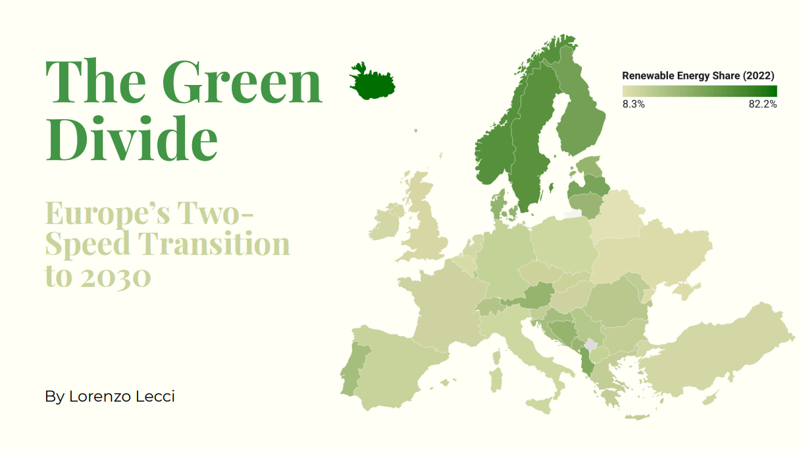
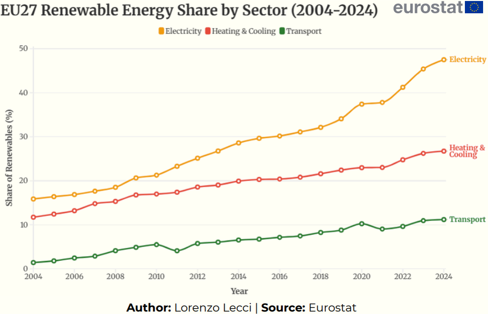
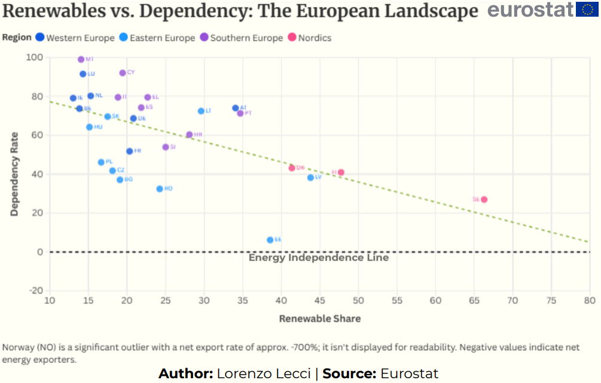

# The Green Divide  

### Europe’s Two-Speed Transition to 2030




## 🌍 About the Project

**The Green Divide** is a data analysis and visualization project exploring the uneven pace of the energy transition across Europe.

Going beyond EU averages, the project highlights:

- Structural differences between European regions  
- The gap between **Electricity** and **Transport** sector transitions  
- Energy vulnerability revealed by the 2022 geopolitical crisis
- 
> **TL;DR:** The analysis reveals a widening "multi-speed" Europe. While the electricity sector is successfully integrating renewables, the transport sector is severely lagging. Furthermore, the 2022 crisis exposed how this green divide is no longer just an environmental issue, but a critical matter of national security and geopolitical autonomy.
---

## 📊 Key Findings & Visualizations

### 1. The Sectoral Anatomy: Greening the Grid, Failing Mobility
Decomposing the aggregate data reveals a massive structural imbalance. The electricity sector exhibits successful, exponential growth—rising from ~15% to over 45%. In stark contrast, the transport sector remains the "sick man" of the transition, barely crossing the 10% threshold despite two decades of policy efforts. We are greening the grid but failing to decarbonize mobility.
<div align="center">
  
</div>

### 2. Geopolitics & Security: The Danger Zone
The 2022 energy crisis redefined renewable energy from an environmental luxury to a critical national security asset. The scatter plot below demonstrates a strong inverse correlation: countries with higher renewable shares exhibit significantly lower fossil fuel import dependency. Major economies like Italy and Germany occupy the top-left quadrant ("Danger Zone"), reflecting the structural exposure that made them primary targets of the gas price shock.
<div align="center">
  
</div>

### 🔍 Dive Deeper
Want to explore the "Nordic Shield" geographic divide, the multi-speed growth rates, and the specific case study of Italy's "Gas Trap"? 

**📄 [Read the full Data Analysis Report (PDF)](report/final_report.pdf)**

## 📂 Repository Structure

```text
The-Green-Divide/
├── data/
│   ├── raw/          # Original data (Eurostat, UNECE, OWID)
│   └── output/       # Cleaned CSVs for visualization
├── images/
│   ├── map_geographic_divide.png       # Choropleth Map (UNECE)
│   ├── line_sectoral_anatomy.png       # Line chart EU27 Sectors
│   ├── line_regional_trends.png        # Line chart Macro-regions
│   ├── slope_growth_rates.png          # Slope chart 2012-2022
│   ├── scatter_dependency.png          # Scatter plot Geopolitics
│   └── area_italy_mix.png              # Stacked area chart Italy
├── notebooks/
│   ├── cover_image.png
│   └── my_project.ipynb
├── report/
│   └── final_report.pdf
├── .gitignore
└── requirements.txt

## How to Reproduce the Analysis

```bash
git clone https://github.com/lolluz01/The-Green-Divide.git
cd The-Green-Divide
pip install -r requirements.txt
jupyter notebook notebooks/my_project.ipynb
```

All data processing steps are fully reproducible using the provided notebook.

## Data & Methodology
Data sources include **Eurostat** (official EU statistics), **UNECE** (SDG indicators), and **Our World in Data**.

### Processing Pipeline
The analysis is automated via Python (`pandas`, `requests`). The workflow includes:
* **Automated Extraction:** Scripts fetch the latest data directly from Eurostat APIs.
* **Regional Grouping:** Countries are aggregated into macro-regions (Nordics, Western, Southern, Eastern Europe) to identify geographical trends.
* **Sector Analysis:** Disaggregation of renewable shares into Electricity, Heating, and Transport.
* **Resilience Metrics:** Merging renewable data with import dependency ratios to assess energy security.

---

## Visualizations
The clean datasets in the `data/output/` folder are optimized for tools like **Flourish**, or **Datawrapper**.
| Output File | Recommended Viz | Description |
| :--- | :--- | :--- |
| `eurostat_sector_gap_flourish.csv` | **Line Chart Race** | Comparing the speed of transition between Electricity and Transport sectors. |
| `eurostat_regional_trends.csv` | **Line Chart (Small Multiples)** | Trends comparison across the 4 European macro-regions. |
| `war_impact_scatter.csv` | **Scatter Plot** | Correlation between % Renewables (Axis X) and Import Dependency (Axis Y). |
| `race_to_zero_growth.csv` | **Slope Chart / Dumbbell** | Growth of renewable share from 2012 to 2022 by country. |

---

## License

This project is licensed under the  
**Creative Commons Attribution 4.0 International (CC BY 4.0)** license.

You are free to:
- **Share** — copy and redistribute the material in any medium or format  
- **Adapt** — remix, transform, and build upon the material  

Under the following terms:
- **Attribution** — You must give appropriate credit, provide a link to the license, and indicate if changes were made.

🔗 https://creativecommons.org/licenses/by/4.0/


---

## Author

**Lorenzo Lecci** *Data Science Student*

[](https://www.linkedin.com/in/lorenzo-lecci-793789297/)


